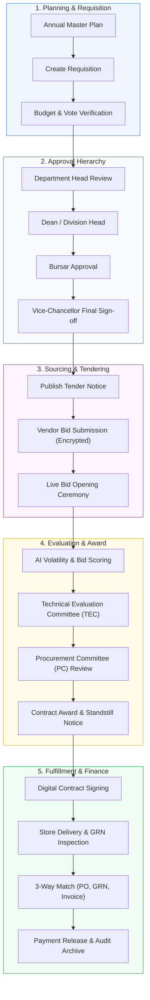

# 🛒 AI-Based Smart Procurement System for University

<div align="center">


<p align="center">
  <b>An AI-Powered, Multi-Tenant SaaS Procurement Governance Platform Engineered with Machine Learning, Explainable AI, and Real-Time Bid Opening Automation.</b><br/>
  <i>University Final Year Undergraduate Research Project — Uva Wellassa University of Sri Lanka</i>
</p>

[Project Overview](#-executive-summary) •
[Academic Context](#-project-ownership--academic-context) •
[Key Features](#-key-features) •
[System Architecture](#-system-architecture) •
[Procurement Lifecycle](#-procurement-lifecycle--workflow) •
[Tech Stack](#-technology-stack) •
[RBAC Engine](#-role-based-access-control-rbac) •
[Getting Started](#-getting-started) •
[API Reference](#-rest-api-reference) •
[License](#-license)

---

</div>

## 🌟 Executive Summary

The **AI-Based Smart Procurement System for University** is an enterprise-grade Software as a Service (SaaS) procurement management platform engineered in accordance with university governance standards and public procurement guidelines (GOSL). Built inside a high-performance **Turborepo monorepo**, the system unifies the complete **45-step university procurement lifecycle** into an integrated, transparent, and auditable digital environment.

It bridges institutional operational gaps through **automated multi-level approvals**, **electronic tendering**, **live-streamed bid opening ceremonies**, **digital contract signing**, and **milestone payment disbursements**. Powered by Natural Language Processing (NLP) and Machine Learning models, the system proactively detects supply chain and price volatility, automates vendor grading, and provides explainable audit rationales for every automated decision.

---

## 🎓 Project Ownership & Academic Context

* **Project Title**: AI-Based Smart Procurement System for University
* **Principal Investigator & Lead Developer**: **Isura Udith**
* **Project Nature**: Undergraduate Final Year Honours Research Project
* **Institution**: **Uva Wellassa University of Sri Lanka (UWU)**
* **License & Intellectual Property**: Full license, project ownership, architecture, and copyright belong to **Isura Udith**.

---

## 🚀 Key Features

### 📋 Strategic Planning & Budgeting (Phases 1–4)
* **Master Procurement Plan (MPP)**: Consolidate annual institutional departmental demands into structured, compliant master plans.
* **Draft Requisition Staging**: Draft, revise, and prepare requisitions prior to formal submission.
* **Budget Allocations & Thresholds**: Dynamic real-time verification against departmental votes, preventing over-commitment and unauthorized spending.
* **Annual Procurement Plans (APP)**: Automated scheduling aligned with fiscal governance frameworks.

### 🔄 End-to-End Requisition Lifecycle
* **Intelligent Requisition Routing**: Multi-tiered approval flows routing dynamically through HODs, Deans, Bursar, and Vice-Chancellor based on financial delegation thresholds.
* **Collaborative Revisioning**: In-line revision notes and detailed action history capturing every change made by authorized officers.
* **Full File Attachment Ingestion**: Automated ingestion and extraction of technical specifications using `pdf-parse` and Cloudinary secure storage.

### 🏛️ E-Tendering & Live Bid Opening Ceremony
* **Digital Tender Publishing**: Configurable public, selective, or direct bidding with automated deadline management and tender security deposits.
* **Encrypted Electronic Bidding**: Vendors submit sealed bids with cryptographic protection preventing premature disclosure.
* **Interactive Bid Opening Ceremony**: A real-time ceremony interface providing synchronized schedule tracking, attendee verification, transparent bid box opening, and public disclosure logs.

### 🤖 Explainable AI & Machine Learning Intelligence
* **Market Trend & Price Volatility Alerts**: Powered by `ml-random-forest` to predict commodity price spikes and supply market risks.
* **NLP-Powered Item Catalog Matching**: Uses natural language algorithms (`natural`) to identify duplicate requisitions and benchmark historical pricing.
* **LLM & Flowise RAG Integration**: Chatflow-assisted procurement guidance, document Q&A, and vendor evaluation synthesis backed by Google Gemini 2.0.
* **Explainable AI (XAI) Audit Logs**: Clear, human-readable rationale explanations accompanying all automated algorithmic scores.

### 📜 Digital Contracts, Milestones & Payments
* **Contract Generation & Digital Execution**: Lifecycle management with automated SLA timers and terms tracking.
* **Milestone Inspection & Verification**: Visual milestone progress, Goods Received Notes (GRN), and Technical Evaluation Committee (TEC) sign-offs.
* **3-Way Matching Engine**: Automatic reconciliation between Purchase Orders (PO), GRNs, and Invoices before payment disbursement.

### 📦 Store & Inventory Management (Phases 7–8)
* **Stock Receipt & GRN Verification**: Immediate inventory updates upon delivery acceptance.
* **Asset Allocation & Dispatch**: Departmental transfer tracking with centralized store asset accountability.

### 🛡️ Enterprise Security & Auditing
* **Immutable Audit Trail**: Chronological event logging recording actor ID, IP address, timestamp, affected resource, and delta states.
* **Hardened Perimeter**: Protected with Helmet, CORS policies, XSS sanitization, Zod schema validation, and rate limiting.

---

## ⚙️ System Architecture

The project leverages a **Turborepo** workspace structure separating the presentation layer, the API core, shared type definitions, and containerized deployment infrastructure:

```
smart-procurement-system/
├── apps/
│   ├── api/                     # Node.js Express 5 REST API & AI Service Engine
│   │   ├── src/
│   │   │   ├── ai/              # ML Models (Random Forest, NLP, RAG connectors)
│   │   │   ├── config/          # Database, Cloudinary, Redis & Email configs
│   │   │   ├── controllers/     # Controller handlers for all domain entities
│   │   │   ├── middlewares/     # Authentication, RBAC, error & validation handlers
│   │   │   ├── models/          # Mongoose database schemas & indexes
│   │   │   ├── routes/          # Express route definitions
│   │   │   ├── services/        # Core business logic services
│   │   │   └── utils/           # Shared API utilities, loggers & helpers
│   │   ├── tests/               # Backend Jest test suites
│   │   └── seed.js              # Comprehensive DB seeder (roles, users, sample data)
│   │
│   └── web/                     # Modern React 19 Single Page Application
│       ├── src/
│       │   ├── assets/          # Static assets, branding, and icons
│       │   ├── components/      # Reusable atomic UI & layout components
│       │   ├── pages/           # Route views (Portals for Admin, Vendor, Finance)
│       │   ├── redux/           # Redux Toolkit slices and global store
│       │   ├── services/        # Axios API client services
│       │   └── utils/           # UI formatters, date utilities, helpers
│       ├── index.html           # SPA entry point
│       └── vite.config.js       # Vite bundler configuration
│
├── packages/
│   └── types/                   # Shared types, constants & centralized RBAC matrix
│       └── rbac.config.js       # Single source of truth for permissions across monorepo
│
├── docker/                      # Production & staging containerization
│   ├── docker-compose.yml       # Multi-service stack (Mongo, Redis, API, Web)
│   ├── Dockerfile.api           # Multi-stage production container for API
│   ├── Dockerfile.web           # Production build container for React / Nginx
│   └── nginx.conf               # Web reverse proxy and routing configuration
│
├── .env.example                 # Environment configuration reference
├── package.json                 # Monorepo root configuration & npm workspaces
├── turbo.json                   # Turborepo task pipeline definition
└── LICENSE                      # ISC Open-Source License
```

---

## 📈 Procurement Lifecycle & Workflow

The platform automates the end-to-end institutional procurement journey:



---

## 🛠️ Technology Stack

| Domain | Technology | Description |
| :--- | :--- | :--- |
| **Frontend Framework** | **React 19** | Modern component architecture, concurrent rendering |
| **Build & Tooling** | **Vite 8 & Turborepo** | Blazing-fast HMR and monorepo pipeline caching |
| **Styling & UI** | **Tailwind CSS v4** | Modern utility-first responsive styling engine |
| **State Management** | **Redux Toolkit** | Centralized predictable state management |
| **Routing** | **React Router v7** | Nested route layouts and auth route guards |
| **Backend Runtime** | **Node.js (>=18) & Express 5** | High-performance asynchronous REST API architecture |
| **Primary Database** | **MongoDB v7 & Mongoose v9** | Schema modeling with transactional guarantees |
| **Caching & Messaging** | **Redis v7** | In-memory session, cache, and task worker broker |
| **AI / Machine Learning** | **`ml-random-forest` & `natural`** | In-process Random Forest forecasting and NLP parsing |
| **Generative AI & RAG** | **Gemini 2.0 Flash & Flowise** | Procurement assistant and semantic document Q&A |
| **File Storage & Parsing** | **Cloudinary & `pdf-parse`** | Cloud media storage and programmatic PDF content parsing |
| **Security & Validation** | **Zod, Helmet, XSS-Clean, JWT** | Strict schema validation, HTTP hardening, dual JWT auth |
| **Containerization** | **Docker & Docker Compose** | Isolated production orchestration with Nginx reverse proxy |

---

## 👥 Role-Based Access Control (RBAC)

The system enforces a granular **Role and Permission-Based Access Control (RBAC/PBAC)** matrix configured in [`packages/types/rbac.config.js`](packages/types/rbac.config.js):

| Role Identifier | Role Title | Hierarchy Level | Primary Responsibilities |
| :--- | :--- | :---: | :--- |
| `super_admin` | **Super Administrator** | 100 | Full system governance, multi-tenant onboarding, configuration |
| `admin` | **Procurement Admin** | 95 | Master data templates, tender configuration, workflow rules |
| `vc` | **Vice-Chancellor** | 90 | Accounting Officer (AO); high-value contract awards & authorizations |
| `bursar` | **Bursar** | 85 | Financial vote controller, final financial authorization |
| `dean` | **Faculty Dean** | 70 | Faculty-level requisition reviews and departmental budget monitoring |
| `department_head` | **Head of Department (HOD)** | 60 | Departmental requisition approval, vote confirmation |
| `procurement_officer`| **Procurement Officer** | 55 | Day-to-day procurement ops, tender drafting, PO processing |
| `finance_officer` | **Finance Officer** | 50 | Budget allocations, invoice verification, 3-way reconciliation |
| `tec_member` | **TEC Member** | 45 | Technical evaluation of bids, compliance matrix scoring |
| `procurement_committee`| **PC Member** | 45 | Commercial bid evaluation and award recommendations |
| `contract_manager` | **Contract Manager** | 40 | Contract drafting, SLA tracking, milestone monitoring |
| `store_manager` | **Store Manager** | 35 | Goods receipt, inspection verification, GRN issue, dispatch |
| `department_user` | **Department Requester**| 25 | Drafts initial purchase requisitions and item requests |
| `supplier` / `vendor` | **Vendor / Bidder** | 10 | Tender discovery, bid submission, invoice submission |
| `auditor` | **Internal / External Auditor**| 5 | Read-only inspection across all audit logs, tenders, and payments |

---

## 🚀 Getting Started

### 📋 Prerequisites

Before setting up the project locally, ensure you have the following installed:

* **Node.js**: `v18.0.0` or higher (recommended: Node LTS v20+)
* **npm**: `v10.0.0` or higher
* **MongoDB**: `v6.0` or `v7.0` (running locally or MongoDB Atlas)
* **Redis**: `v6.0+` (optional for local dev; recommended for SLA workers)
* **Git**: Installed and configured

---

### 🔧 Environment Setup

Create an active `.env` configuration file in the project root:

```bash
cp .env.example .env
```

Configure your environment variables as required:

```ini
# --- Server Environment ---
NODE_ENV=development
PORT=5000
API_VERSION=v1

# --- Database & In-Memory Cache ---
MONGODB_URI=mongodb://127.0.0.1:27017/uwu_procurement
REDIS_URL=redis://127.0.0.1:6379

# --- Authentication & Tokens ---
JWT_SECRET=your_jwt_access_secret_key_minimum_32_chars
JWT_EXPIRES_IN=7d
JWT_REFRESH_SECRET=your_jwt_refresh_secret_key_minimum_32_chars
JWT_REFRESH_EXPIRES_IN=30d

# --- Artificial Intelligence (Optional for Local Core) ---
GEMINI_API_KEY=your_google_gemini_api_key
GEMINI_MODEL=gemini-2.0-flash
GEMINI_EMBEDDING_MODEL=text-embedding-004

# --- Document Storage & Ingestion ---
CLOUDINARY_CLOUD_NAME=your_cloud_name
CLOUDINARY_API_KEY=your_api_key
CLOUDINARY_API_SECRET=your_api_secret

# --- Email Notifications ---
SMTP_HOST=smtp.gmail.com
SMTP_PORT=587
SMTP_USER=your_email@domain.com
SMTP_PASS=your_smtp_app_password

# --- Web Frontend ---
CLIENT_URL=http://localhost:5173
VITE_API_URL=http://localhost:5000/api/v1

# --- Multi-Tenant Settings ---
DEFAULT_TENANT_ID=uwu-main
```

---

### 📦 Installation

Install workspace dependencies for all packages:

```bash
npm install
```

---

### 🗄️ Database Seeding

Populate the database with foundational roles, permissions, administrative entities, and test users:

```bash
npm run db:seed
```

> [!NOTE]
> Ensure MongoDB is active before running the seed command. The seeder generates pre-configured test credentials for `super_admin`, `admin`, `dean`, `hod`, `vendor`, and others.

---

### 🏃 Running the Application

#### 1. Run Complete Monorepo (Web + API simultaneously)
```bash
npm run dev
```

#### 2. Run Individual Applications
* **Backend API only**:
  ```bash
  npm run dev:api
  ```
  *Accessible at:* `http://localhost:5000` (Healthcheck: `http://localhost:5000/api/v1/health`)

* **Frontend Web Client only**:
  ```bash
  npm run dev:web
  ```
  *Accessible at:* `http://localhost:5173`

---

### 🧪 Tests & Code Quality

Run tests across all packages:
```bash
npm run test
```

Run ESLint verification:
```bash
npm run lint
```

Build optimized production bundles:
```bash
npm run build
```

---

## 🐳 Docker Deployment

The application includes production-ready Dockerfiles and a Compose orchestrator to run the complete environment with zero local runtime dependencies.

### Spin up the full container stack:
```bash
docker compose -f docker/docker-compose.yml up --build -d
```

### Inspect service status:
```bash
docker compose -f docker/docker-compose.yml ps
```

### Access running services:
* **Web Application**: `http://localhost:5173`
* **API Service**: `http://localhost:5000/api/v1`
* **MongoDB**: `localhost:27017`
* **Redis**: `localhost:6379`

### Stop and clean up containers:
```bash
docker compose -f docker/docker-compose.yml down
```

---

## 📡 REST API Reference

All API routes are prefixed with `/api/v1`:

| Endpoint Category | Base Path | Description | Access Control |
| :--- | :--- | :--- | :--- |
| **Authentication** | `/auth` | Login, token refresh, logout, password recovery | Public / Authenticated |
| **Users & Roles** | `/users` | User management, profile, status, role assignments | Admin / Super Admin |
| **Requisitions** | `/procurements` | Requisition creation, status update, multi-tier approvals | Requester, HOD, Dean, Bursar, VC |
| **Draft Procurements**| `/draft-procurements` | Staging area for drafting unsubmitted item requests | Requesters |
| **Master Plans** | `/master-plans` | Institutional strategic planning & annual procurement plans | Admin, Bursar, VC |
| **Budget Allocations**| `/budget-allocations` | Department vote management, expenditure limits | Finance, Bursar, Admin |
| **Tenders** | `/tenders` | Tender publishing, bid submission, opening ceremonies | Procurement Officers, Vendors |
| **Vendors** | `/vendors` | Vendor directory, qualification grading, blacklisting | Procurement Admin, Officers |
| **Contracts** | `/contracts` | Digital contract generation, terms, milestones | Contract Managers, Officers, VC |
| **Payments** | `/payments` | Invoice validation, 3-way matching, payment releases | Finance Officer, Bursar |
| **Store & Inventory** | `/inventory` | GRN processing, stock levels, item issue/dispatch | Store Managers |
| **Explainable AI** | `/ai` | Price alerts, NLP similarity, LLM evaluation synthesis | Procurement Officers, Admin |
| **Audit Logs** | `/audit-logs` | Immutable audit records and system event stream | Auditors, Super Admin |
| **Notifications** | `/notifications` | User alerts, system broadcasts, email logs | Authenticated Users |
| **Workflow Engine** | `/workflow` | Multi-step lifecycle progression and status gates | System, Officers, Admin |

---

## 🔒 Security Best Practices

* **Dual-Token Authentication**: Short-lived Access Tokens (JWT) paired with secure Refresh Tokens.
* **Granular RBAC**: Defense-in-depth authorization verified at both route middleware and controller levels.
* **Request Sanitization**: All incoming inputs strictly sanitized against NoSQL injection and Cross-Site Scripting (XSS).
* **HTTP Security Headers**: Powered by Helmet to prevent clickjacking, MIME sniffing, and unwanted framing.
* **Rate Limiting**: IP-based rate limiting on sensitive authentication and transaction routes.
* **Audit Immutability**: All sensitive entity mutations append records to an append-only audit collection.

---

## 🔄 Release History

### 🟢 v1.2.0 (Current Release)
* **RBAC Expansion**: Granted permission sets for `System` and `Executive` roles to manage and curate procurements.
* **User Audit Enrichment**: Added detailed mutation tracking capturing the identity and modification rationale of editing officers.
* **Tender Service Hardening**: Secured bid opening controllers against premature decryption and validated input range boundaries.
* **Bid Opening Ceremony UI**: Added real-time event status timelines and digital ceremony tracking.
* **Linting & Monorepo Optimization**: Fixed unused variables, optimized dependency builds, and validated Turborepo tasks.
* **Environment Sanitization**: Fully scrubbed all sensitive sample tokens and hardened repository hygiene.

### 🟡 v1.1.0
* **Explainable AI (XAI)**: Integrated transparent reasoning logs for automated bid grading models.
* **Predictive Pricing Alerts**: Deployed Random Forest classification algorithms for market volatility warnings.
* **Automated Document Parsing**: Integrated `pdf-parse` for automated extraction of technical specifications.

### 🔴 v1.0.0
* **Initial Release**: Multi-tenant database foundation, core requisition lifecycle, and baseline RBAC engine.

---

## 📄 License & Ownership

This software application, system design, source code, and associated documentation are the intellectual property of **Isura Udith**, developed as a **University Final Year Research Project** at **Uva Wellassa University of Sri Lanka**.

Licensed under the **[ISC License](LICENSE)**. Full license and ownership reside with the author:

```
ISC License

Copyright (c) 2026 Isura Udith

Project: AI-Based Smart Procurement System for University
Author & Principal Investigator: Isura Udith
Affiliation: Uva Wellassa University of Sri Lanka (Final Year Research Project)

Permission to use, copy, modify, and/or distribute this software for any purpose
with or without fee is hereby granted, provided that the above copyright notice
and this permission notice appear in all copies.

THE SOFTWARE IS PROVIDED "AS IS" AND THE AUTHOR DISCLAIMS ALL WARRANTIES WITH
REGARD TO THIS SOFTWARE INCLUDING ALL IMPLIED WARRANTIES OF MERCHANTABILITY
AND FITNESS. IN NO EVENT SHALL THE AUTHOR BE LIABLE FOR ANY SPECIAL, DIRECT,
INDIRECT, OR CONSEQUENTIAL DAMAGES OR ANY DAMAGES WHATSOEVER RESULTING FROM
LOSS OF USE, DATA OR PROFITS, WHETHER IN AN ACTION OF CONTRACT, NEGLIGENCE OR
OTHER TORTIOUS ACTION, ARISING OUT OF OR IN CONNECTION WITH THE USE OR
PERFORMANCE OF THIS SOFTWARE.
```

---

<div align="center">
  <sub>Developed, Designed & Maintained by <b>Isura Udith</b> • University Final Year Research Project • <b>Uva Wellassa University of Sri Lanka</b></sub>
</div>