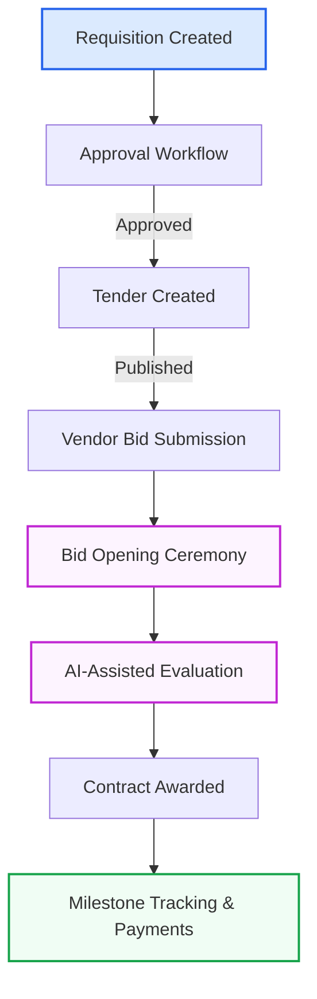

# 🛒 UWU AI-Based Smart Procurement System

> **Version 1.2.0** — SaaS Multi-Tenant MERN Stack Enterprise Procurement Platform

---

## 🌟 Overview

The **UWU AI-Based Smart Procurement System** is a modern, enterprise-grade Software as a Service (SaaS) application designed to streamline, automate, and intelligentize the entire procurement lifecycle. Built on a robust MERN stack monorepo, it manages everything from initial purchase requisitions and approvals to tendering, electronic bidding, live bid opening ceremonies, contract signing, and milestone-based payments.

Integrated with Machine Learning (ML) models and Natural Language Processing (NLP), the system actively analyzes market trends to generate predictive alerts, performs automated bid evaluations, and logs decisions with full AI explainability audits.

---

## 🛠️ Technology Stack

| Layer | Technologies & Frameworks |
| :--- | :--- |
| **Frontend (`apps/web`)** | React 19, Redux Toolkit, React Router v7, Tailwind CSS v4, React Hook Form, Yup, Recharts, Lucide Icons |
| **Backend (`apps/api`)** | Node.js, Express.js 5, MongoDB (Mongoose v9), Zod (Validation), bcryptjs, JWT |
| **AI / ML Engine** | `ml-random-forest` (Market Alerts), `natural` (NLP-based bid matching) |
| **Monorepo Tooling** | Turborepo, Workspace Packages |
| **Storage & Services** | Cloudinary (Document/Attachment Storage), Nodemailer (Email notifications), `pdf-parse` (Invoices/Proposal parsing) |

---

## 📈 System Workflow



---

## ⚙️ Architecture & Core Modules

The repository is structured as a Turborepo monorepo:

- **`apps/web`**: React SPA application built with Vite. It consumes the API endpoints and renders interfaces with Tailwind CSS styling.
- **`apps/api`**: Express backend providing RESTful endpoints, running background workers, and housing machine learning services.
- **`packages/types`**: Shared types and interfaces across the monorepo.

### Core Modules

1. **Multi-Tenant Authentication & RBAC**: Segmented access control supporting roles: `super_admin`, `procurement_officer`, `vendor`, `finance`, `executive`, `system`, and others.
2. **Requisition Lifecycle**: 45-step procurement workflow engine supporting multi-stage approvals, modifications, and audits.
3. **Tendering & E-Bidding**: Secure publishing of tenders, vendor registration, and encrypted bid submission. Includes live Bid Opening ceremonies.
4. **AI Intelligence**: Predictive market alerts for supply chain/pricing risks and transparent evaluation log reasoning.
5. **Contract & Finance**: Digital agreement tracking, milestone execution, and payout releases.

---

## 🚀 Getting Started

### 📋 Prerequisites

- **Node.js**: v18+ (npm v10+)
- **MongoDB**: v6.0+ or MongoDB Atlas instance
- **Redis**: Running instance for SLA background tasks and caching

### 🔧 Environment Setup

Create a `.env` file in the root directory (based on [.env.example](.env.example)):

```bash
# Server Configuration
NODE_ENV=development
PORT=5000

# Databases
MONGODB_URI=mongodb://localhost:27017/uwu_procurement
REDIS_URL=redis://localhost:6379

# Secrets
JWT_SECRET=your_jwt_secret
JWT_REFRESH_SECRET=your_jwt_refresh_secret

# Third-Party Integrations
CLOUDINARY_CLOUD_NAME=your_cloud_name
CLOUDINARY_API_KEY=your_api_key
CLOUDINARY_API_SECRET=your_api_secret

# AI Key
GEMINI_API_KEY=your_gemini_api_key
```

### 📦 Installation

Install dependencies from the root directory:

```bash
npm install
```

### 🏃 Running the Application

To run the full stack (Frontend & Backend simultaneously) using Turborepo:

```bash
npm run dev
```

To run individual packages separately:

- **API Backend**: `npm run dev:api`
- **Web Frontend**: `npm run dev:web`

To seed the database with initial configurations, mock users, and mock procurements:

```bash
npm run db:seed
```

> [!NOTE]
> Ensure your MongoDB server is running before executing `npm run db:seed` or starting the dev server.

---

## 🔄 Release Log & Changelog

### 🟢 Version 1.2.0 (Current Release)

- **Role Permissions Upgrades**: Added permissions to allow users with `System` and `Executive` roles to edit and delete procurements.
- **Audit Trails**: Enhanced procurement edits to record detailed user action metadata (notes/fields capturing who edited the requisition).
- **Tendering Stability**: Patched controller and service layers (`tender.service.js`, `tender.controller.js`) to secure inputs and validate bidding ranges.
- **Bid Opening Ceremony**: Implemented a responsive live status timeline interface (`CeremonyTimeline`) for public/private bid opening events.
- **Linter & Build Cleanup**: Resolved multiple unused variables, parameters, and syntax warnings across React packages, enabling clean production builds.
- **Architectural Cleanup**: Removed deprecated files, organized folders, and stabilized Turbo caching pipelines.

### 🟡 Version 1.1.0

- **AI Explainability**: Integrated decision-making tracking for AI-driven vendor grading.
- **Smart Market Alerts**: Configured Random Forest classification to evaluate pricing inflation trends.
- **PDF Document Ingestion**: Integrated `pdf-parse` backend utilities to scan and parse incoming vendor PDFs.

### 🔴 Version 1.0.0

- **Initial SaaS MERN Stack MVP**: Multi-tenant database separation, Core Requisitions engine, and basic RBAC.

---

💼 *Managed by the UWU Procurement Division.*
